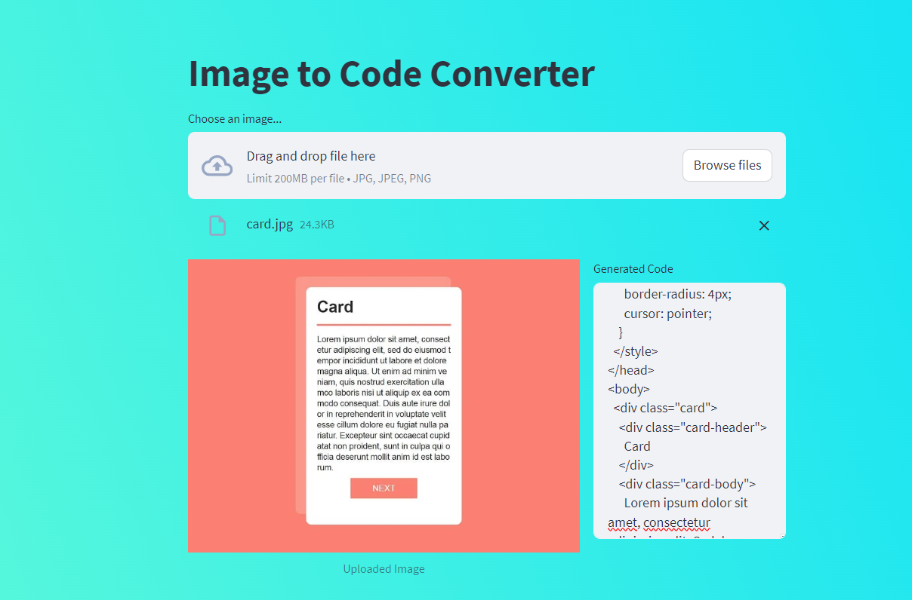

# GEMINI AI - Image to Code Converter




## Overview

I tested the newly launched GEMINI AI and built the Image to Code Converter using Streamlit. This application takes an image as input and generates HTML and CSS code to recreate the visual representation of the screenshot.

## Features

- Upload an image to generate HTML and CSS code.
- Faithfully captures the structure and styling of the original design.
- Considers the arrangement of elements, colors, fonts, and other visual attributes.
- Provides well-organized and readable HTML and CSS code snippets.
- Adds a gradient background to the HTML body using colors from the input image.

## How to Use

1. **Clone this repository:**

   ```bash
   git clone [https://github.com/yourusername/image-to-code-converter.git](https://github.com/Nikk579/Image-to-Code-Converter.git)
   cd image-to-code-converter

2. **Install the required dependencies:**

pip install -r requirements.txt

3. **Run the Streamlit app:**

streamlit run app.py

**Technologies Used**
Streamlit
GEMINI AI
PIL (Pillow)

## Demo Video


